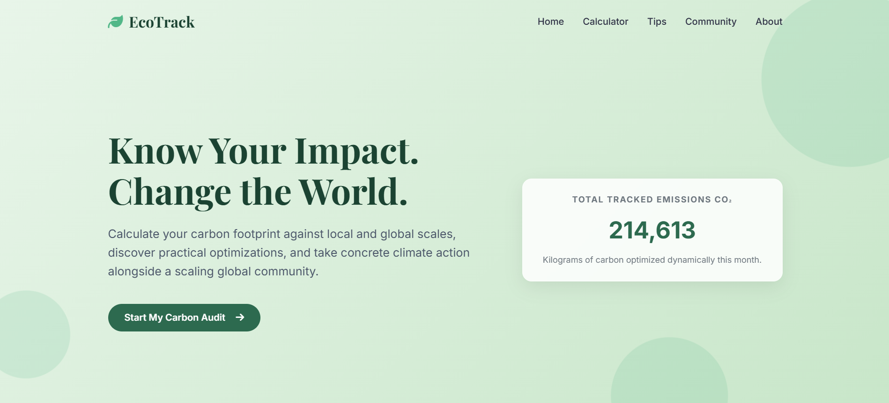
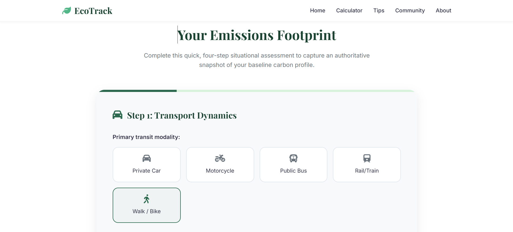
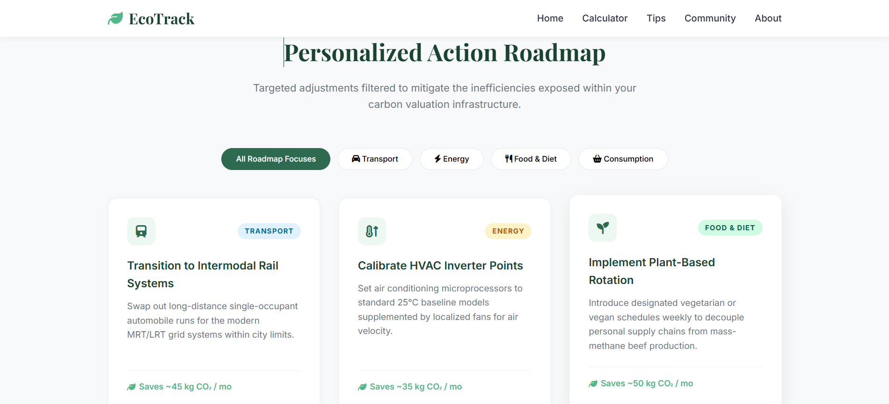
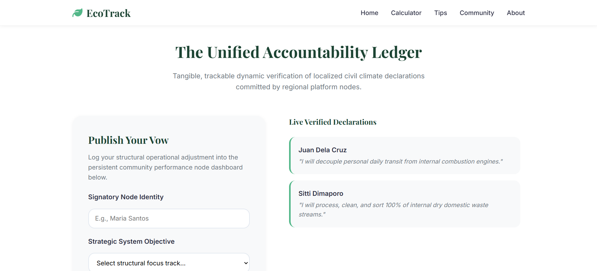
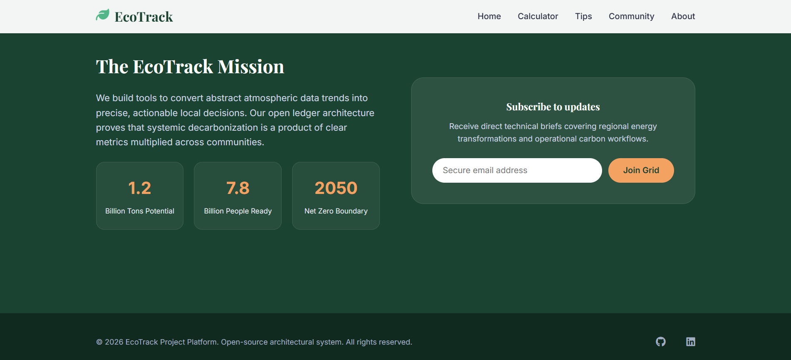

# README.md

# 🌿 EcoTrack

EcoTrack is a fully interactive, responsive, and standalone frontend web application designed to help users measure their personal carbon footprint and explore sustainable lifestyle improvements.

The project uses only frontend technologies and runs completely inside the browser. It does not require a backend server, external database, or framework installation.

EcoTrack demonstrates modern client-side development through interactive interfaces, real-time calculations, browser storage, and animated visual feedback.

# Home Section

<p align="center">
  
</p>

# Calculator Section

<p align="center">
    
</p>

# Tips Section
<p align="center">
  
</p>

# Community Section
<p align="center">
  
</p>

# About Section
<p align="center">
  
</p>

---

## ✨ Features

### Carbon Footprint Audit

Users can complete a guided lifestyle assessment covering:

* Transportation
* Housing
* Diet
* Consumption

The system calculates environmental impact based on user responses.

### Real-Time Eco Analytics

EcoTrack provides:

* Carbon footprint estimates
* Eco-Score ratings
* Category-based impact breakdowns
* Sustainability recommendations

All calculations run directly in the browser.

### Interactive Visualizations

The dashboard includes:

* Animated carbon score gauges
* Dynamic progress indicators
* Canvas-based visual effects
* Responsive data presentation

### Mitigation Simulator

Users can simulate how sustainable actions affect their footprint.

Features include:

* Adjustable impact sliders
* Real-time score changes
* Animated environmental feedback
* Visual growth indicators

### Pledge Wall

Users can create environmental commitments.

Examples:

* Reduce waste
* Save electricity
* Use sustainable transportation
* Practice recycling

Pledges are stored using browser localStorage, allowing information to remain available after refreshing the page.

### Sustainability Action Filters

Users can explore recommendations through categorized actions:

* Energy
* Transportation
* Food
* Waste
* Water

---

## 🛠️ Technology Stack

| Technology        | Purpose                                   |
| ----------------- | ----------------------------------------- |
| HTML5             | Semantic structure and accessibility      |
| CSS3              | Layout, animations, and responsive design |
| JavaScript ES6+   | Application logic and interaction         |
| HTML5 Canvas      | Data visualization rendering              |
| Local Storage API | Browser-based persistence                 |
| Google Fonts      | Typography                                |
| Font Awesome      | Interface icons                           |

---

## 📂 Project Structure

```
EcoTrack/
│
├── index.html
├── indexstyle.css
├── script.js
├── README.md
├── CHANGELOG.md
├── CODE_OF_CONDUCT.md
```

---

## 🚀 Installation

EcoTrack requires no installation.

Clone the repository:

```
git clone https://github.com/yourusername/EcoTrack.git
```

Open the project folder and launch:

```
index.html
```

using any modern browser.

---

## 💻 Development

Recommended tools:

* Visual Studio Code
* Live Server extension
* Browser Developer Tools

The project can be modified directly by editing:

* index.html
* indexstyle.css
* script.js

---

## 🎯 Project Goals

EcoTrack was created to demonstrate how frontend technologies can create meaningful interactive experiences without requiring complex backend infrastructure.

The project focuses on:

* Environmental awareness
* User interaction
* Data visualization
* Responsive design
* Client-side application development

---

## 🌎 Future Improvements

Possible future enhancements:

* Additional footprint categories
* More detailed environmental reports
* Exportable sustainability reports
* More visualization options
* Optional cloud synchronization
* Progressive Web App support

---

## 📄 License

This project is licensed under the MIT License.

See LICENSE.md for more information.

---

## 👨‍💻 Author

EcoTrack was developed as a frontend portfolio project showcasing modern HTML, CSS, and JavaScript development practices.